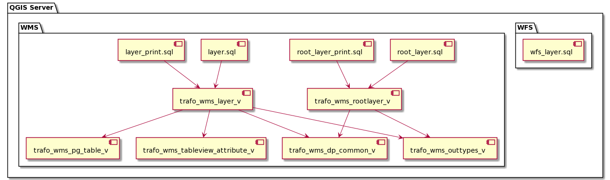

# Json Templating Views und Queries

Die von den sql2json ausgelösten queries verwenden teilweise gemeinsame SQL Views. Die Views wiederum sind untereinander abhängig.
Das folgende Diagramm dokumentiert die Abhängigkeiten.

## WMS Basis Views

### trafo_wms_outtypes_v

"Steuerungsview". Diese bestimmt, welche Dataproduct-Subtypen aus welchen Datenquellen
von den SQL-Queries und damit von den Trafos zurückgegeben werden.

### trafo_wms_dp_common_v

Gibt die gängigen Attribute für ein Dataproduct sowie die Informationen
zum Publikations-Status und zu Subtyp und Datenherkunft (dtype) zurück.

### trafo_wms_pg_table_v

Erstellt das für qmlContent.json notwendige json-Fragment für
alle Postgres-Tabellen.

@Martin: 
Diese wrid im Moment nur von trafo_wms_layer_v konsumiert.  
Wenn das nach deinem Gegenlesen so bleibt, dann werde ich die View auflösen.

Todo: Evtl. einpflegen in trafo_wms_layer_v

### trafo_wms_tableview_attribute_v

Erstellt das für qmlContent.json notwendige json-Fragment aller 
Attribute einer TableView.

@Martin: 
Diese wrid im Moment nur von trafo_wms_layer_v konsumiert.  
Wenn das nach deinem Gegenlesen so bleibt, dann werde ich die View auflösen.

Todo: Evtl. einpflegen in trafo_wms_layer_v

## WMS Views zwecks Filtering für "normalen" und print WMS

Der Print-WMS umfasst nur wenige Ebenen mehr wie der API-WMS. Um eine massive
SQL-Code Verdoppelung zu vermeiden, decken die folgend beschriebenen Views den
Ebenenumfang für den Print-WMS ab.  
Für den API-WMS wird mittels Attribut "print_only" gefiltert.

### trafo_wms_rootlayer_v

Gibt alle Ebenen zurück, welche im WMS auf der obersten Ebene "root" erscheinen.   
ZU BEACHTEN: In einer oder mehreren Layergruppen enthaltene SingleActor erscheinen 
nicht auf der obersten Ebene. Dies erfolgt durch ein Filter in der View, unabhängig
von der Einstellung im SIMI.

### trafo_wms_layer_v

Gibt die für den WMS notwendigen Eigenschaften einer Ebene aus.

