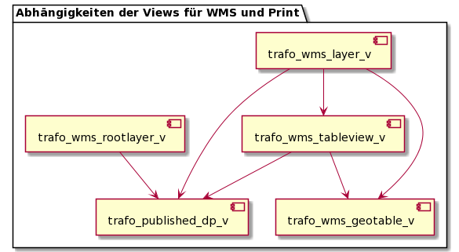

# Json Templating Views und Queries

Die von den sql2json ausgelösten queries verwenden teilweise gemeinsame SQL Views. Die Views wiederum sind untereinander abhängig.
Das folgende Diagramm dokumentiert die Abhängigkeiten.

## Abhängigkeit der Views für WMS und Print

Die Views sind in jeweiligen *.sql dokumentiert (Ablage in Ordner ../views)